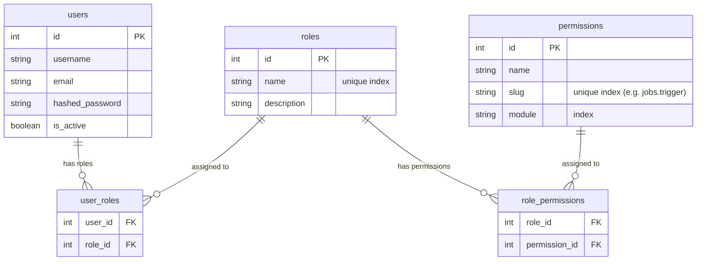

# Advanced FastAPI Microservices SaaS Monorepo

Welcome to the enterprise-grade FastAPI Microservices SaaS Monorepo. This repository has been structured using highly professional, decoupled architecture patterns, modern **Domain-Driven Design (DDD)**, and **Clean Architecture** principles.

All microservices communicate behind a unified API Gateway with robust background task orchestration, shared stateless utilities, and hot-reload enabled development setups.

---

## 📂 Repository Directory Structure

```text
.
├── Makefile                     # Development CLI helper targets
├── docker-compose.yml           # Multi-container orchestration config
├── packages/
│   └── shared/                  # Shared internal utility package
│       ├── auth/                # Stateless JWT validation middleware
│       ├── database/            # SQLAlchemy 2.0 Async engine and declarative base
│       └── setup.py             # Shared packaging installation script
└── services/
    ├── auth-service/            # Authentication Microservice (Domain-Driven Design)
    │   ├── src/
    │   │   ├── application/     # Core Business Flow (Auth UseCases)
    │   │   ├── domain/          # Pure Entities (User model)
    │   │   ├── infrastructure/  # Database Repositories
    │   │   ├── presentation/    # FastAPI Routers & Pydantic Schemas
    │   │   └── main.py          # App Entrypoint & Lifespan Hooks (Auto Table Creation)
    │   ├── Dockerfile
    │   └── requirements.txt
    └── notification-service/    # Notification & Worker Service
        ├── src/
        │   ├── infrastructure/  # Celery configuration, Worker setup, & Tasks
        │   ├── presentation/    # Protected routers (JWT verified via Shared Lib)
        │   └── main.py          # App Bootstrapper
        ├── Dockerfile
        └── requirements.txt
```

---

## ⚡ SaaS Architecture Features

1. **Traefik API Gateway (`Port 8081`)**:
   - Acts as a unified entrypoint routing external HTTP traffic dynamically to the correct microservice based on path prefixes (`/api/v1/auth` and `/api/v1/jobs`).
2. **Shared Library (`packages/shared/`)**:
   - Reusable type-safe database engines and cryptographic stateless token check helpers. Installed locally inside each service's Docker environment.
3. **Stateless JWT Authorization**:
   - Downstream services (like `notification-service`) authenticate requests cryptographically using the shared JWT verifier, avoiding redundant database lookups.
4. **Celery Worker & Beat**:
   - Asynchronous job execution and cron-like periodic operations offloaded cleanly to a Redis broker.
5. **Real-time Development Hot-Reloading**:
   - Source code directories are mapped inside Docker via live volume binds. Together with Uvicorn's `--reload` flag, changes on the host instantly update the running containers.
6. **Auto Database Initializer**:
   - Automatic database table generation is handled asynchronously on service boot using FastAPI lifespan listeners.

---

## 🛠️ CLI Development Commands (Makefile)

Use the built-in `Makefile` to quickly manage the orchestrations locally:

| Command | Description |
| :--- | :--- |
| `make dstart` | Starts the cluster interactively in the foreground (showing logs). |
| `make up` | Starts the entire cluster in the background (detached mode). |
| `make build` | Rebuilds container images and starts them in the background. |
| `make buildCache`| Fully rebuilds all container images from scratch without using cache. |
| `make down` | Gracefully shuts down and removes all containers and networks. |
| `make restart` | Shuts down the cluster and spins it back up in detached mode. |

---

## 📚 Interactive Swagger Documentation (API Gateway)

When running the cluster, the interactive FastAPI documentation for both services is unified and hosted through the **Traefik Gateway (`port 8081`)** to allow **cross-service authorization token handshakes** to work flawlessly:

*   🔒 **Auth Service Swagger**: [http://localhost:8081/api/v1/auth/docs](http://localhost:8081/api/v1/auth/docs)
*   ✉️ **Notification Service Swagger**: [http://localhost:8081/api/v1/jobs/docs](http://localhost:8081/api/v1/jobs/docs)

### How to test the endpoints:
1. Open the **Auth Docs** (`/api/v1/auth/docs`) and call `/register` and `/login` to acquire a valid user JWT token.
2. Open the **Notification Docs** (`/api/v1/jobs/docs`), click the **Authorize lock** button, paste your JWT, and click Authorize.
3. You can now trigger secure tasks like `/api/v1/jobs/trigger-email`!

---

## 🎛️ Local Administration (pgAdmin)

A local pgAdmin database administration panel has been configured for easy data inspection:
*   **Address**: [http://localhost:5050](http://localhost:5050)
*   **Email**: `root@admin.com`
*   **Password**: `root@123`

---

## 📬 Local SMTP Mail Viewer (Mailpit)

A local SMTP server has been integrated to intercept and test outgoing emails in your browser without utilizing an external SMTP provider:
*   **Web Console**: [http://localhost:8025](http://localhost:8025)
*   **SMTP Port**: `1025` (Accessible within the container network via host name `mailpit`)

---

## 🗄️ Database Migrations (Alembic)

Database migrations are scoped and managed locally inside each microservice container (e.g., `services/auth-service/`) to ensure high independence. 

### How to Create & Apply Migrations:

When modifying your SQLAlchemy models (e.g., adding tables/columns to `user.py`), follow these steps:

#### 1. Generate the Migration Revision script:
Run the autogenerate command inside the running service container. This compares your SQLAlchemy code models against the active database state and writes a diff migration file:
```bash
docker compose exec auth-service alembic revision --autogenerate -m "added_cols_description"
```

#### 2. Apply Migrations to the Database:
To execute the generated migration script and upgrade your active Postgres database schema to the latest version, run:
```bash
docker compose exec auth-service alembic upgrade head
```

#### 3. Restore Local Host File Ownership:
Because Alembic runs as `root` inside the docker container runtime, the newly generated migration file in `alembic/versions/` is initially owned by root. Restore user permissions to edit/view files locally on your host machine:
```bash
docker compose exec auth-service chown -R 1000:1000 /app/services/auth-service/alembic
```

---

## 🛡️ Granular Database-Backed RBAC & Permissions

The monorepo uses a highly scalable, professional **Many-to-Many Role-Based Access Control (RBAC)** architecture that supports granular database-backed permission mapping and stateless downstream checking.

### 📊 Relational Schema Structure



### 🔑 High Performance Stateless Claims Verification

To prevent high-latency, synchronous database lookups in downstream microservices, permissions are compiled at login and processed **statelessly** through JWT claims:

1. **Authentication Stage (`auth-service`)**:
   Upon authentication, the user's role permissions are queried and aggregated. The complete list of permission slugs (e.g., `["jobs.trigger", "customers.view"]`) is embedded directly into the JWT payload claim under `"permissions": [...]`.
2. **Stateless Middleware Stage (`packages/shared/auth/middleware.py`)**:
   Downstream microservices (like `notification-service`) validate the token cryptographically and extract the permissions array statelessly in $O(1)$ time.
3. **Endpoint Protection Stage (`PermissionChecker`)**:
   Endpoints specify their exact required permission slug using FastAPI dependency injection.

---

### 🛡️ How to Secure Microservice Endpoints

Use the class-based `PermissionChecker` dependency inside your FastAPI routers:

```python
from fastapi import APIRouter, Depends
from packages.shared.auth.middleware import PermissionChecker, TokenData

router = APIRouter()

# Secure this endpoint using PermissionChecker
@router.post("/trigger-email")
def trigger_email(
    email: str,
    token_data: TokenData = Depends(PermissionChecker("jobs.trigger"))
):
    return {"status": "Success", "caller_role": token_data.role}
```

*   **Backward Compatibility**: The existing `RoleChecker(["admin", "user"])` class remains fully supported and functional for checking coarse-grained role-based restrictions.

---

### 🌱 Seeding Defaults & Quick Verification

On application startup, the database lifespan automatically seeds the following:
*   **Permissions**: `jobs.trigger`, `customers.view`, `customers.create`, `customers.update`, `customers.delete`
*   **Roles**:
    *   `admin`: Full granular permissions granted.
    *   `user`: Restricted permissions (`customers.view` only).
*   **Superadmin**:
    *   **Username**: `superadmin`
    *   **Password**: `admin123`
    *   **Role**: `admin`

#### Running End-to-End Verification

An automated dependency-free verification script is available in the root workspace to test permissions, roles, and endpoints. To run it:

```bash
python3 verify_rbac.py
```